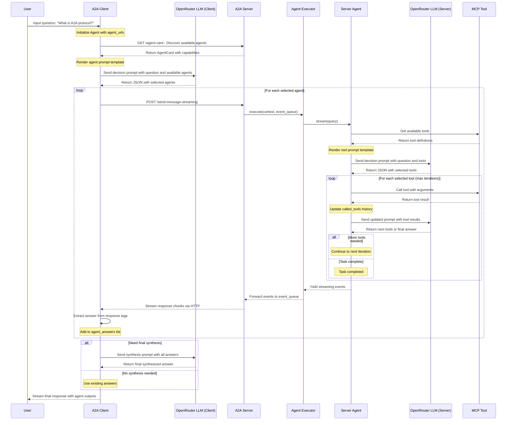

# How to work together: A2A + MCP

This repository demonstrates how to set up and use the [a2a-python SDK](https://github.com/google/a2a-python) to create a simple server and client implement a2a protocol, and the agent sever is implemented by mcp.

## Overview

- **A2A (Agent-to-Agent):** A protocol and SDK for building interoperable AI agents.
- **This Example:** Shows how to run a basic A2A server and client, exchange messages, and view the response.

## Prerequisites

- Python 3.13+
- [uv](https://github.com/astral-sh/uv) (for fast dependency management and running)
- An API key for OpenRouter (set as `OPENROUTER_API_KEY`)

## Installation

1. **Clone the repository:**
   ```bash
   git clone https://github.com/sing1ee/a2a-mcp-openrouter
   cd https://github.com/sing1ee/a2a-mcp-openrouter
   ```

2. **Install dependencies:**
   ```bash
   uv pip install -e .
   ```

3. **Set environment variables:**
   ```bash
   export OPENROUTER_API_KEY=your-openrouter-api-key
   ```

   Or create a `.env` file with:
   ```
   OPENROUTER_API_KEY=your-openrouter-api-key
   ```

   **Note:** You can get your OpenRouter API key from [https://openrouter.ai/](https://openrouter.ai/)

## Running the Example

### 1. Start the Server

```bash
uv run --env-file .env a2a-server
```
- The server will start on port 9999.

validate the agent card: 
- [a2a protocol validator](https://a2aprotocol.ai/a2a-protocol-validator)
- Guide: [How to validate your agent card](https://a2aprotocol.ai/blog/how-to-use-a2a-protocol-validator)

### 2. Run the Client

In a new terminal:

```bash
uv run --env-file .env a2a-client --question "What is A2A protocol?"
```

- The client will connect to the server and send a request.

### 3. View the Response

- The response from the client will be saved to [response.xml](./response.xml).

## Configuration

The system uses the following configuration:
- **Model:** `google/gemini-flash-1.5` via OpenRouter
- **Base URL:** `https://openrouter.ai/api/v1`

## File Structure

- `src/a2a_mcp_openrouter/server/`: Server implementation.
- `src/a2a_mcp_openrouter/client/`: Client implementation.
- `response.xml`: Example response from the client.

## Troubleshooting

- **Missing dependencies:** Make sure you have `uv` installed.
- **API key errors:** Ensure `OPENROUTER_API_KEY` is set correctly.
- **Port conflicts:** Make sure port 9999 is free.

## A2A vs MCP: Protocol Similarities and Unified Approach

Through this implementation, we discovered that **A2A (Agent-to-Agent)** and **MCP (Model Context Protocol)** share remarkable architectural similarities. Both protocols follow a similar pattern for discovery, capability exchange, and execution.

### Unified Implementation Pattern

**Key Discovery**: Both A2A and MCP follow the same underlying implementation pattern:

- **HTTP-based Communication**: Both use HTTP for communication (A2A uses REST APIs, MCP uses Server-Sent Events)
- **Prompt-driven Design**: Both rely on LLM prompts to decide what to call and how to call it
- **Discovery Mechanism**: Both provide ways to discover available capabilities
- **Structured Responses**: Both return structured data that can be processed programmatically

Looking at the `mcp.py` implementation, we can see:
```python
# MCP tool discovery via HTTP
async with sse_client(url) as (read, write):
    resources = await session.list_tools()
    
# Generate prompt for LLM decision making  
return template.render(tools=resources.tools)

# Execute tool call via HTTP
return await session.call_tool(tool_name, arguments=arguments)
```

This is conceptually identical to A2A agent calling pattern - discover capabilities, use LLM to decide what to call, then execute the call.

### A2A as Universal Interface

**Key Insight**: A2A can serve as a unified interface for both agent-to-agent communication and tool invocation, because the calling patterns are essentially the same:

1. **A2A → Agent**: `Client → HTTP → Agent → LLM Response`
2. **A2A → Tool**: `Client → HTTP → Tool Wrapper → MCP Tool Response`

Both patterns use:
- HTTP communication
- Capability discovery
- LLM-driven decision making
- Structured request/response format

### Benefits of This Unified Approach

- **Single Interface**: Clients only need to understand one calling pattern
- **Interoperability**: Mix agents and tools seamlessly in the same workflow
- **Consistent Architecture**: Same implementation pattern across different capability types
- **LLM-native Design**: Both leverage LLM reasoning for intelligent capability selection

This demonstrates that A2A and MCP are not competing protocols but complementary patterns that can be unified under a single interface paradigm.

## System Architecture and Flow

Below is a detailed sequence diagram showing the complete flow of the A2A protocol from client input to final response:



### Key Features

- **Agent Discovery**: Automatic discovery of available agents via A2A protocol
- **LLM-Driven Selection**: Intelligent agent and tool selection using LLM reasoning
- **MCP Integration**: Seamless integration with MCP tools for knowledge retrieval
- **Streaming Pipeline**: Real-time streaming responses throughout the entire pipeline
- **Iterative Processing**: Multi-iteration tool calling with maintained context

### Flow Description

The system follows these main phases:

**Client Phase**: User inputs question → Client discovers agents → LLM selects relevant agents

**Server Phase**: Server receives request → Agent discovers tools → LLM selects tools → Tools execute iteratively

**Response Phase**: Results stream back through the pipeline → Client synthesizes final answer → User receives response

This architecture demonstrates the power of the A2A protocol in creating interoperable AI agents that can discover each other and collaborate, while leveraging MCP tools for accessing external knowledge sources.
